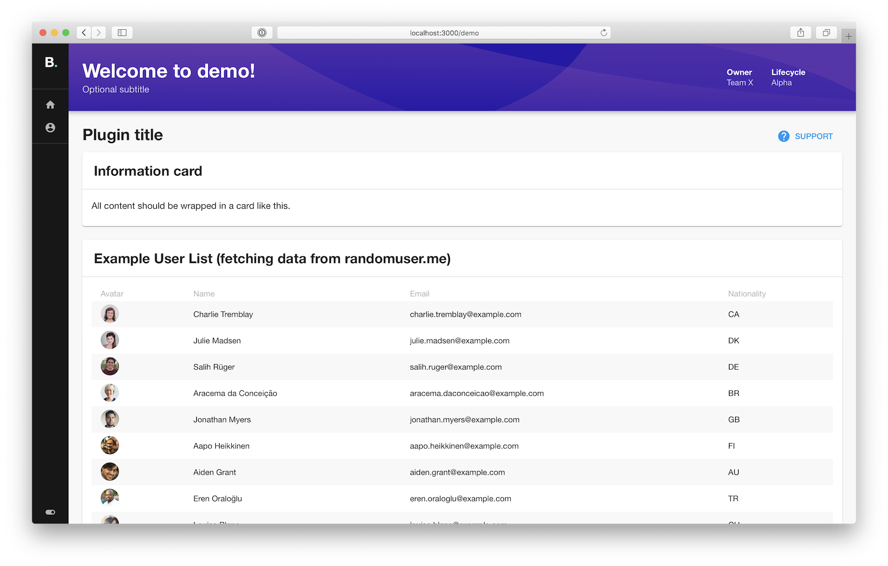

Backstage is a single-page application composed of a set of plugins.

Our goal for the plugin ecosystem is that the definition of a plugin is flexible
enough to allow you to expose pretty much any kind of infrastructure or software
development tool as a plugin in Backstage. By following strong
[design guidelines](../dls/design.md) we ensure the overall user experience
stays consistent between plugins.

## Creating a plugin

To create a plugin, follow the steps outlined [here](create-a-plugin.md).

## Suggesting a plugin

If you start developing a plugin that you aim to release as open source, we
suggest that you create a
[new Issue](https://github.com/backstage/backstage/issues/new?labels=plugin&template=plugin_template.md&title=%5BPlugin%5D+THE+PLUGIN+NAME).
This helps the community know what plugins are in development.

You can also use this process if you have an idea for a good plugin but you hope
that someone else will pick up the work.

## Integrate into the Software Catalog

If your plugin isn't supposed to live as a standalone page, but rather needs to
be presented as a part of a Software Catalog (e.g. a separate tab or a card on
an "Overview" tab), then check out
[the instruction](integrating-plugin-into-software-catalog.md) on how to do it.
